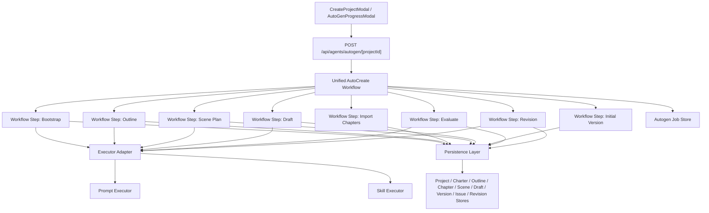

# 全自动创作工作流统一重构计划

## 背景

当前系统存在两条“AI 全自动创作”链路：

1. `基准测试（HTTP API）`
   文件入口：
   - `apps/web/src/lib/workflows/auto-create-workflow.ts`
   - `apps/web/src/app/api/agents/autogen/[projectId]/route.ts`

2. `Skill 智能创作`
   文件入口：
   - `apps/web/src/lib/workflows/skill-based-workflow.ts`
   - `apps/web/src/app/api/agents/autogen/[projectId]/route.ts`

两条链路在“生成方式”之外，还分叉了：
- 步骤编排
- 落库方式
- 版本创建
- 评估问题生成
- 修订任务生成与应用
- 失败处理
- Job 完成判定

这导致当前系统出现结构性问题：
- Skill 模式生成了 deliverable，但没有进入主系统数据链
- HTTP API 模式是真闭环，但容错弱
- 两套链路行为漂移，测试和 UI 难以对齐
- 前端把两者都叫“AI 全自动”，但实际不是同一个产品能力

---

## 重构目标

统一为：

- **一条工作流链**
- **两种执行器**
  - `prompt executor`
  - `skill executor`

也就是说：

- 业务步骤、状态推进、落库逻辑、闭环验收只有一套
- Skill 与 Prompt 的差别仅存在于“每一步如何生成结果”

---

## 目标架构图



---

## 重构原则

### 1. 工作流只有一套

以下内容必须收敛到统一工作流：
- 步骤顺序
- 步骤状态推进
- 失败处理
- 重试策略
- 数据落库
- 最终完成验收

### 2. 执行器只负责“生成”

执行器负责：
- 生成 Charter 内容
- 生成 Outline 内容
- 生成 Scene 规划
- 生成 Draft 正文
- 生成评估结果
- 生成修订结果

执行器不负责：
- 直接决定系统状态
- 直接决定 job 完成
- 绕开主链自行持久化

### 3. 统一 Persistence

无论 Skill 还是 Prompt，产物都必须统一写入：
- `projectStore`
- `chapterStore`
- `sceneStore`
- `draftSegmentStore`
- `versionStore`
- `issueStore`
- `revisionStore`
- `outline` file collection

### 4. 完成态必须基于“真实产物”判定

job 完成的最低要求：
- Charter 已落库
- Outline 已落库
- 导入章节数 > 0
- 每章至少有场景或正文
- 建立了初始版本
- 若开启评估：必须有评估结果或 issue
- 若开启修订：必须执行 issue -> revision -> apply 的闭环

---

## 现状问题到目标映射

### A. Skill 模式问题

当前问题：
- `skill-based-workflow.ts` 自己编排一套影子流程
- `bootstrap-skill.ts` 调用了与现有 store 漂移的 API
- 章节导入未补全主链需要的字段
- 版本 / issue / revision 没有接入统一主链
- `success: false` 仍可能被 job 记为 `completed`

目标状态：
- Skill 只作为 executor
- 所有落库都由统一 workflow 完成
- Skill 只返回标准化 deliverable

### B. HTTP API 模式问题

当前问题：
- 虽然是真主链，但步骤刚性串联
- 缺少失败补偿
- 缺少统一结果验收

目标状态：
- 继续保留主链优势
- 补统一失败策略、步骤验收、产物校验

---

## 文件级重构计划

## 第一层：统一工作流层

### 1. 新增统一工作流入口

新文件：
- `apps/web/src/lib/workflows/unified-auto-create-workflow.ts`

职责：
- 编排整个自动创作闭环
- 管理每一步的开始、进度、完成、失败
- 调用 executor adapter 获取内容
- 调用 persistence service 写入系统
- 统一 job 完成条件

建议核心接口：

```ts
type ExecutorMode = 'prompt' | 'skill';

interface UnifiedWorkflowOptions {
  project: Project;
  targetChapters: number;
  runEvaluation: boolean;
  runRevisions: boolean;
  executorMode: ExecutorMode;
  onStepStart?: (step: AutoCreateStepName, message?: string) => void;
  onStepProgress?: (step: AutoCreateStepName, progress: number, message?: string) => void;
  onStepComplete?: (step: AutoCreateStepName, message?: string) => void;
  onChapterProgress?: (message: string | null) => void;
}
```

### 2. 旧工作流收敛

改造文件：
- `apps/web/src/lib/workflows/auto-create-workflow.ts`
- `apps/web/src/lib/workflows/skill-based-workflow.ts`

策略：
- `auto-create-workflow.ts` 保留为兼容壳，内部转调 `unified-auto-create-workflow.ts`
- `skill-based-workflow.ts` 拆掉工作流职责，只保留 Skill executor 适配逻辑

最终目标：
- 不再存在两套独立编排逻辑

---

## 第二层：执行器适配层

### 3. 新增执行器适配器

新文件：
- `apps/web/src/lib/workflows/workflow-executor.ts`

职责：
- 根据 `executorMode` 选择：
  - Prompt executor
  - Skill executor

建议接口：

```ts
interface WorkflowExecutor {
  bootstrap(input: BootstrapStepInput): Promise<BootstrapStepResult>;
  outline(input: OutlineStepInput): Promise<OutlineStepResult>;
  scenePlan(input: ScenePlanStepInput): Promise<ScenePlanStepResult>;
  write(input: WriteStepInput): Promise<WriteStepResult>;
  evaluate(input: EvaluateStepInput): Promise<EvaluateStepResult>;
  revise(input: ReviseStepInput): Promise<ReviseStepResult>;
}
```

### 4. Prompt executor

新文件：
- `apps/web/src/lib/workflows/executors/prompt-executor.ts`

职责：
- 封装当前基于 agent / API 的生成能力

映射来源：
- `bootstrap-agent`
- `outline-agent`
- `scene-plan` API / agent
- `writer-agent`
- `critic-agent`
- `repair-agent`

### 5. Skill executor

新文件：
- `apps/web/src/lib/workflows/executors/skill-executor.ts`

职责：
- 封装 Skill 侧能力
- 只返回标准 deliverable，不做主链落库

映射来源：
- `bootstrap-skill.ts`
- `outline-skill.ts`
- `scene-plan-skill.ts`
- `write-skill.ts`
- `evaluate-skill.ts`
- `revision-skill.ts`

---

## 第三层：统一持久化层

### 6. 新增工作流持久化服务

新文件：
- `apps/web/src/lib/workflows/workflow-persistence.ts`

职责：
- 把各步骤 deliverable 写进主系统
- 统一封装以下动作：
  - 保存 Charter
  - 保存 Outline
  - 从 Outline 导入 Chapter
  - 创建 Scene
  - 保存 Draft Segment
  - 创建 Initial Version
  - 创建 Evaluation Issues
  - 创建 Revision Tasks
  - 运行并应用 Revision

建议接口：

```ts
saveCharter(projectId, charter)
saveOutline(projectId, outline)
importChaptersFromOutline(projectId, outline)
saveScenePlan(projectId, chapterId, scenes)
saveDraftSegment(projectId, chapterId, sceneId, content)
createInitialVersion(projectId, chapterId, content)
persistEvaluation(projectId, chapterId, evaluationResult)
persistRevisionAndApply(projectId, chapterId, issue)
```

### 7. 修正 Skill 直接写库的做法

改造文件：
- `apps/web/src/lib/skills/skills/bootstrap-skill.ts`
- `apps/web/src/lib/skills/skills/write-skill.ts`
- `apps/web/src/lib/skills/skills/revision-skill.ts`
- `apps/web/src/lib/skills/skills/evaluate-skill.ts`

改造方式：
- 从“skill 内部直接写库”
- 改为“skill 仅返回 deliverable”

例如：
- `bootstrap-skill.ts`
  - 不再直接调用 `projectStore.saveCharter/addMemory`
  - 只返回 `charter + memories`

- `write-skill.ts`
  - 不再直接 `draftSegmentStore.upsert`
  - 只返回生成正文

- `revision-skill.ts`
  - 不再直接 `revisionStore.create`
  - 只返回修订内容与 apply 建议

---

## 第四层：入口与 Job 层

### 8. 改造 autogen 路由

改造文件：
- `apps/web/src/app/api/agents/autogen/[projectId]/route.ts`

目标：
- 只调用统一 workflow
- 通过 `executorMode` 控制执行器
- 禁止 `success: false` 时被记为 completed

建议接口：

```ts
POST /api/agents/autogen/[projectId]
{
  "targetChapters": 2,
  "runEvaluation": true,
  "runRevisions": true,
  "executorMode": "skill" | "prompt"
}
```

必须修改：
- 删除 `useSkillBased` 分叉工作流逻辑
- 改成 `executorMode`
- 若 workflow result 未通过验收，必须 `failAutoGenJob`

### 9. 加强 job 完成校验

改造文件：
- `apps/web/src/lib/workflows/autogen-job-store.ts`
- `apps/web/src/app/api/agents/autogen/[projectId]/route.ts`

新增：
- `validateWorkflowResult(result)`  

校验项：
- charterExists
- outlineExists
- importedChapters > 0
- initialVersionsCreated > 0
- runEvaluation 时评估结果存在
- runRevisions 时 revision 应用记录存在

---

## 第五层：前端入口层

### 10. 改造创建弹窗的模式表达

改造文件：
- `apps/web/src/components/project/create-project-modal.tsx`
- `apps/web/src/components/project/auto-gen-progress-modal.tsx`

目标：
- 前端不再理解成“两套工作流”
- 只理解成“一套流程 + 两种执行模式”

建议文案：
- `Skill 智能创作（实验中）`
- `标准执行模式（Prompt/HTTP）`

前端提交改为：

```ts
{
  useSkillBased: true
}
```

过渡期建议：
- 前端可继续传 `useSkillBased`
- 后端在 route 中转换为 `executorMode`

最终建议：
- 前端显式改成 `executorMode`

---

## 分阶段实施顺序

### Phase 1：先止血

目标：
- 不再出现假成功

实施：
1. `autogen route` 改成失败不标 completed
2. 增加 workflow result 验收
3. Skill 模式前端标注“实验中”

### Phase 2：统一工作流壳

目标：
- 两种模式都走同一个 orchestrator

实施：
1. 新建 `unified-auto-create-workflow.ts`
2. 新建 `workflow-executor.ts`
3. 将 `auto-create-workflow.ts` 和 `skill-based-workflow.ts` 收口为 adapter

### Phase 3：统一持久化

目标：
- 所有产物都进主链

实施：
1. 新建 `workflow-persistence.ts`
2. Skill 各 handler 去掉直接写库逻辑
3. 版本、issue、revision 全部统一由 workflow persistence 处理

### Phase 4：增强鲁棒性

目标：
- 真正可作为正式能力

实施：
1. 补步骤失败补偿
2. 补部分章节失败时的继续执行策略
3. 补最终导出前质量门禁汇总

---

## 验收标准

重构完成后，需要满足以下验收：

1. Skill 与 Prompt 模式都走同一条 workflow 文件
2. 两种模式都能完成以下闭环：
   - Charter
   - Outline
   - Chapter import
   - Scene generation
   - Draft generation
   - Initial version
   - Evaluation
   - Revision apply
3. 前端 Job 状态与真实产物一致
4. 不允许再出现“UI 显示完成，但没有 Charter / Outline / Issue / Revision”的情况

---

## 当前最优先改动建议

如果只做最小可落地版本，建议先做：

1. `autogen/[projectId]/route.ts`
   - 修假成功
2. `unified-auto-create-workflow.ts`
   - 建统一壳
3. `workflow-executor.ts`
   - Skill / Prompt 只作为执行器
4. `workflow-persistence.ts`
   - 先接 Charter / Outline / Version / Evaluation / Revision 主链

这样可以最快把现在两条分叉链收成一条可控主链。
